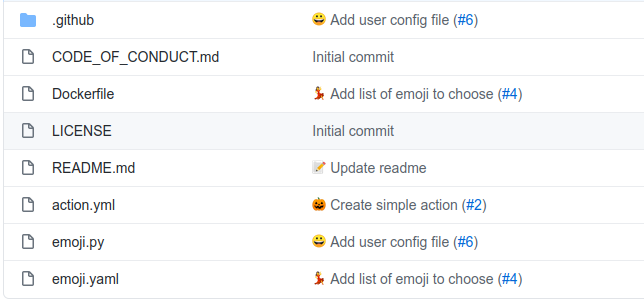

# Emoji action

This is a fun github action, to add random emoji to every pull request title :rocket::heart:

Your github repo will look very pretty :heart_eyes::bouquet::tomato:



## Inputs

| Name         |      Required      | Description                                                                                                                      |
| ------------ | :----------------: | -------------------------------------------------------------------------------------------------------------------------------- |
| GITHUB_TOKEN | :heavy_check_mark: | In order for GitHub to trigger the rebuild of your page you must provide the action with the repositories provided GitHub token. |

## Example

### Action

Easy to use **Emoji action** by add [github workflow file](https://docs.github.com/en/free-pro-team@latest/actions/quickstart)

```yml
name: Add Emoji
on: pull_request

jobs:
  add-emoji:
    runs-on: ubuntu-latest
    steps:
      - name: Checkout 🛎️
        uses: actions/checkout@v2

      - name: Add emoji 🥰
        uses: tiena2cva/action-emoji@v0.6
        with:
          GITHUB_TOKEN: ${{ secrets.GITHUB_TOKEN }}
```

### Configure

You can use configure file to customize what emoji will be chosen

Create `.github/emoji.yml` based on the following template.

```yml
# Configuration for action-emoji - https://github.com/tiena2cva/action-emoji

# Include all emoji supported or not
all: false

# Choose what list of emoji you want to use. Support 4 list: people, nature, objects, places.
# If "all" is true, all of list will be included
lists:
  - people
  - nature
  - objects
  - places

# User custom emoji list
customs:
  - atom
  - suspect
  - electron
  - england
```
